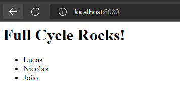

# Desafio 02:Nginx com Node.js
Desafio 02 do módulo Docker do curso Full Cycle 3.0, cujo objetivo era preparar uma configuração do Docker Compose para levantar três containers dockers:
* Uma aplicação Node JS (container app)
* Um banco de dados MySQL (container db)
* Um servidor Nginx funcionadno como proxy reverso (container nginx)

O container app aguarda o container db ficar pronto junto com o seu banco de dados através da DOCKERIZE. Então ele adiciona três registros ao banco de dados, os quais serão listados ao acessá-lo pelo navegador através do container nginx.

Para subir os containers, pasta executar o comando
```
docker-compose up
```

Então a aplicação poderá ser acesasda pelo:
```
http://localhost:8080/
```

Você verá um resultado parecido com a imagem abaixo:
<h4 align="center">
    
</h4>

